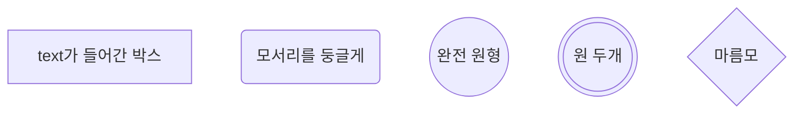
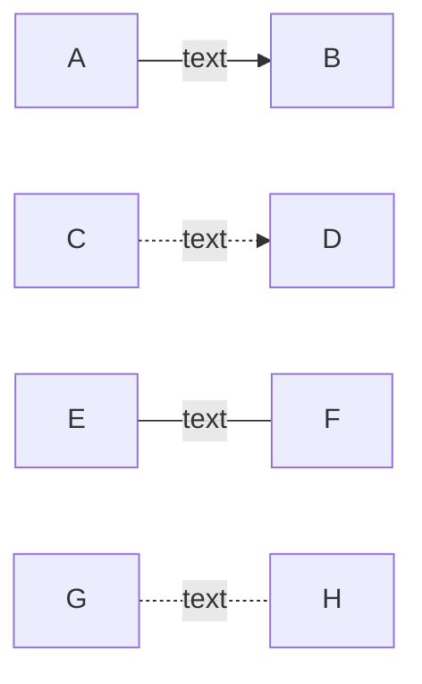

# action-concurrency

- https://docs.github.com/en/actions/using-jobs/using-concurrency

```mermaid
flowchart TD
    id1[text가 들어간 박스]
    id2(모서리를 둥글게)
    id3((완전 원형))
    id4(((원 두개)))
    id5{마름모}
```

```mermaid
flowchart LR
    A -- text --> B
    C -. text .-> D
    E -- text --- F
    G -. text .- H
```
